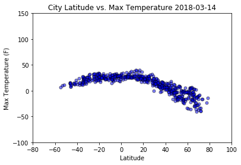
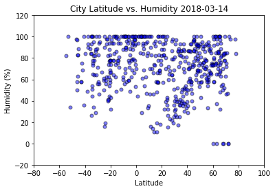
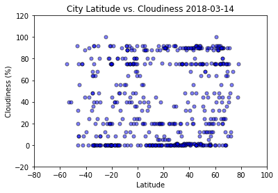
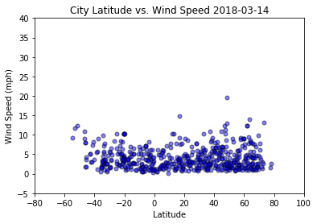

```python
#observations:
#1.Temperature is higher while closer to the equator
#2.Humidity has no obvious correlation with latitude
#3.Windspeed and cloudiness also has no obvious correlation with latitude
```


```python
# Dependencies
import csv
import matplotlib.pyplot as plt
import openweathermapy as ow
import pandas as pd
import json
import datetime
import random
from random import randrange, uniform
from citipy import citipy
import requests as req

# import api_key from config file
#from config import api_key
api_key='57c0d7f92d4b6f18c0c7d5d51a1d2db1'
# Create a settings object with your API key and preferred units
settings = {"units": "metric", "appid": api_key}
```


```python
#get data for each cities
#lists and dict
weather_data = []
maxtemp =[]
humidity=[]
cloudiness=[]
windspeed=[]
country=[]
date =[]
lati =[]
longi = []
cities=[]
myweather_df={}

while len(cities) < 500:
    counter=0
    precounter=0
    samplesize=100
    finalcities=80
    #cities=["paris", "london", "beijing"]
    
    #why samplesize throwing error while larger than 100???
    lat = random.sample(list(range(-90, 90)), samplesize)
    lon = random.sample(list(range(-180, 180)), samplesize)

    #for counter in range(0, samplesize) :
    while counter < finalcities and precounter < samplesize:   

        city = citipy.nearest_city(lat[precounter], lon[precounter])
        citi=city.city_name + ','+city.country_code

        precounter+=1
#         print('precounter='+str(precounter))
#         print(citi)

        #url='http://api.openweathermap.org/data/2.5/find?appid='+api_key+'&lat='+str(lat[x])+'&lon='+str(lon[x])+'&cnt=3'
        if citi not in cities:

            try:
                response = ow.get_current(citi, **settings)
                #if citi not in cities:
                cities.append(citi)            
                counter +=1
                #print('counter='+str(counter))

            except :
                print("City is not found from Openweathermap.")
                continue
        else:
            continue
        weather_data.append(response) 
        print(len(weather_data))
    
    #response = req.get(url).json()
    #json.dumps(response,indent=4, sort_keys=True)


#weather_data = [ow.get_current(city, **settings) for city in cities]
#weather_data = ow.get_current_for_group(cities, **settings) 
    #weather_data[0]
```

    precounter=1
    hobart,au
    counter=1
    1
    precounter=2
    portland,au
    counter=2
    2
    precounter=3
    qaanaaq,gl
    counter=3
    3
    precounter=4
    salalah,om
    counter=4
    4
    precounter=5
    vanimo,pg
    counter=5
    5
    precounter=6
    illoqqortoormiut,gl
    City is not found from Openweathermap.
    precounter=7
    kodiak,us
    counter=6
    6
    precounter=8
    porto novo,cv
    counter=7
    7
    precounter=9
    porbandar,in
    counter=8
    8
    precounter=10
    louisbourg,ca
    City is not found from Openweathermap.
    precounter=11
    qaanaaq,gl
    precounter=12
    zyryanka,ru
    counter=9
    9
    precounter=13
    cabo san lucas,mx
    counter=10
    10
    precounter=14
    bonavista,ca
    counter=11
    11
    precounter=15
    punta arenas,cl
    counter=12
    12
    precounter=16
    faanui,pf
    counter=13
    13
    precounter=17
    chicama,pe
    counter=14
    14
    precounter=18
    jamestown,sh
    counter=15
    15
    precounter=19
    bambous virieux,mu
    counter=16
    16
    precounter=20
    castro,cl
    counter=17
    17
    precounter=21
    henties bay,na
    counter=18
    18
    precounter=22
    katsuura,jp
    counter=19
    19
    precounter=23
    sao filipe,cv
    counter=20
    20
    precounter=24
    vestmanna,fo
    counter=21
    21
    precounter=25
    kavaratti,in
    counter=22
    22
    precounter=26
    faanui,pf
    precounter=27
    maykor,ru
    counter=23
    23
    precounter=28
    acari,pe
    counter=24
    24
    precounter=29
    bredasdorp,za
    counter=25
    25
    precounter=30
    kaitangata,nz
    counter=26
    26
    precounter=31
    nuuk,gl
    counter=27
    27
    precounter=32
    tasiilaq,gl
    counter=28
    28
    precounter=33
    busselton,au
    counter=29
    29
    precounter=34
    cherskiy,ru
    counter=30
    30
    precounter=35
    chuy,uy
    counter=31
    31
    precounter=36
    norton shores,us
    counter=32
    32
    precounter=37
    san juan,ar
    counter=33
    33
    precounter=38
    jamestown,sh
    precounter=39
    iquique,cl
    counter=34
    34
    precounter=40
    petauke,zm
    counter=35
    35
    precounter=41
    saint george,bm
    counter=36
    36
    precounter=42
    sibolga,id
    counter=37
    37
    precounter=43
    ushuaia,ar
    counter=38
    38
    precounter=44
    busselton,au
    precounter=45
    dawson creek,ca
    counter=39
    39
    precounter=46
    thompson,ca
    counter=40
    40
    precounter=47
    nizhneyansk,ru
    City is not found from Openweathermap.
    precounter=48
    yeletskiy,ru
    City is not found from Openweathermap.
    precounter=49
    ribeira grande,pt
    counter=41
    41
    precounter=50
    yumen,cn
    counter=42
    42
    precounter=51
    kodiak,us
    precounter=52
    tabiauea,ki
    City is not found from Openweathermap.
    precounter=53
    khatanga,ru
    counter=43
    43
    precounter=54
    avarua,ck
    counter=44
    44
    precounter=55
    rio gallegos,ar
    counter=45
    45
    precounter=56
    rikitea,pf
    counter=46
    46
    precounter=57
    port alfred,za
    counter=47
    47
    precounter=58
    esperance,au
    counter=48
    48
    precounter=59
    albany,au
    counter=49
    49
    precounter=60
    mataura,pf
    City is not found from Openweathermap.
    precounter=61
    ancud,cl
    counter=50
    50
    precounter=62
    pokhara,np
    counter=51
    51
    precounter=63
    malindi,ke
    counter=52
    52
    precounter=64
    rikitea,pf
    precounter=65
    albany,au
    precounter=66
    datong,cn
    counter=53
    53
    precounter=67
    kasangulu,cd
    counter=54
    54
    precounter=68
    rikitea,pf
    precounter=69
    rikitea,pf
    precounter=70
    port elizabeth,za
    counter=55
    55
    precounter=71
    new norfolk,au
    counter=56
    56
    precounter=72
    mataura,pf
    City is not found from Openweathermap.
    precounter=73
    illoqqortoormiut,gl
    City is not found from Openweathermap.
    precounter=74
    hobart,au
    precounter=75
    basco,ph
    counter=57
    57
    precounter=76
    coquimbo,cl
    counter=58
    58
    precounter=77
    vaini,to
    counter=59
    59
    precounter=78
    hithadhoo,mv
    counter=60
    60
    precounter=79
    vaini,to
    precounter=80
    provideniya,ru
    counter=61
    61
    precounter=81
    san joaquin,bo
    counter=62
    62
    precounter=82
    mataura,pf
    City is not found from Openweathermap.
    precounter=83
    thompson,ca
    precounter=84
    shouguang,cn
    counter=63
    63
    precounter=85
    seymchan,ru
    counter=64
    64
    precounter=86
    bredasdorp,za
    precounter=87
    geraldton,ca
    counter=65
    65
    precounter=88
    port alfred,za
    precounter=89
    dikson,ru
    counter=66
    66
    precounter=90
    bethel,us
    counter=67
    67
    precounter=91
    lolua,tv
    City is not found from Openweathermap.
    precounter=92
    nikolskoye,ru
    counter=68
    68
    precounter=93
    albany,au
    precounter=94
    souillac,mu
    counter=69
    69
    precounter=95
    san patricio,mx
    counter=70
    70
    precounter=96
    new norfolk,au
    precounter=97
    phalombe,mw
    counter=71
    71
    precounter=98
    waw,sd
    City is not found from Openweathermap.
    precounter=99
    andros town,bs
    counter=72
    72
    precounter=100
    punta arenas,cl
    precounter=1
    prince george,ca
    counter=1
    73
    precounter=2
    kizilskoye,ru
    counter=2
    74
    precounter=3
    east london,za
    counter=3
    75
    precounter=4
    halalo,wf
    City is not found from Openweathermap.
    precounter=5
    tulungagung,id
    counter=4
    76
    precounter=6
    new norfolk,au
    precounter=7
    kawalu,id
    counter=5
    77
    precounter=8
    bluff,nz
    counter=6
    78
    precounter=9
    ushuaia,ar
    precounter=10
    vaini,to
    precounter=11
    meulaboh,id
    counter=7
    79
    precounter=12
    arlit,ne
    counter=8
    80
    precounter=13
    avera,pf
    City is not found from Openweathermap.
    precounter=14
    kieta,pg
    counter=9
    81
    precounter=15
    tukrah,ly
    City is not found from Openweathermap.
    precounter=16
    port lincoln,au
    counter=10
    82
    precounter=17
    bur gabo,so
    City is not found from Openweathermap.
    precounter=18
    mount gambier,au
    counter=11
    83
    precounter=19
    korla,cn
    counter=12
    84
    precounter=20
    butaritari,ki
    counter=13
    85
    precounter=21
    hermanus,za
    counter=14
    86
    precounter=22
    la ronge,ca
    counter=15
    87
    precounter=23
    ponta do sol,cv
    counter=16
    88
    precounter=24
    busselton,au
    precounter=25
    huangpi,cn
    counter=17
    89
    precounter=26
    qasigiannguit,gl
    counter=18
    90
    precounter=27
    rocha,uy
    counter=19
    91
    precounter=28
    onega,ru
    counter=20
    92
    precounter=29
    port alfred,za
    precounter=30
    tigil,ru
    counter=21
    93
    precounter=31
    kamenskoye,ru
    City is not found from Openweathermap.
    precounter=32
    mahebourg,mu
    counter=22
    94
    precounter=33
    mataura,pf
    City is not found from Openweathermap.
    precounter=34
    hasaki,jp
    counter=23
    95
    precounter=35
    sentyabrskiy,ru
    City is not found from Openweathermap.
    precounter=36
    qaanaaq,gl
    precounter=37
    alofi,nu
    counter=24
    96
    precounter=38
    east london,za
    precounter=39
    lamar,us
    counter=25
    97
    precounter=40
    east london,za
    precounter=41
    ilulissat,gl
    counter=26
    98
    precounter=42
    hobart,au
    precounter=43
    saint-philippe,re
    counter=27
    99
    precounter=44
    mar del plata,ar
    counter=28
    100
    precounter=45
    smithers,ca
    counter=29
    101
    precounter=46
    otradnoye,ru
    counter=30
    102
    precounter=47
    rikitea,pf
    precounter=48
    butaritari,ki
    precounter=49
    rikitea,pf
    precounter=50
    taltal,cl
    counter=31
    103
    precounter=51
    salalah,om
    precounter=52
    puerto escondido,mx
    counter=32
    104
    precounter=53
    ponta do sol,cv
    precounter=54
    rikitea,pf
    precounter=55
    vardo,no
    counter=33
    105
    precounter=56
    shestakovo,ru
    counter=34
    106
    precounter=57
    mataura,pf
    City is not found from Openweathermap.
    precounter=58
    husavik,is
    counter=35
    107
    precounter=59
    kailua,us
    counter=36
    108
    precounter=60
    tuktoyaktuk,ca
    counter=37
    109
    precounter=61
    caiaponia,br
    counter=38
    110
    precounter=62
    albany,au
    precounter=63
    cape town,za
    counter=39
    111
    precounter=64
    torbay,ca
    counter=40
    112
    precounter=65
    kodiak,us
    precounter=66
    mataura,pf
    City is not found from Openweathermap.
    precounter=67
    jiwani,pk
    counter=41
    113
    precounter=68
    campbell river,ca
    counter=42
    114
    precounter=69
    vaini,to
    precounter=70
    bluff,nz
    precounter=71
    waipawa,nz
    counter=43
    115
    precounter=72
    rikitea,pf
    precounter=73
    kapaa,us
    counter=44
    116
    precounter=74
    along,in
    counter=45
    117
    precounter=75
    arona,es
    counter=46
    118
    precounter=76
    ushuaia,ar
    precounter=77
    castro,cl
    precounter=78
    galgani,sd
    City is not found from Openweathermap.
    precounter=79
    albany,au
    precounter=80
    terrasini,it
    counter=47
    119
    precounter=81
    vaini,to
    precounter=82
    puerto ayora,ec
    counter=48
    120
    precounter=83
    great yarmouth,gb
    counter=49
    121
    precounter=84
    jamestown,sh
    precounter=85
    lubumbashi,cd
    counter=50
    122
    precounter=86
    jamestown,sh
    precounter=87
    bonthe,sl
    counter=51
    123
    precounter=88
    daru,pg
    counter=52
    124
    precounter=89
    henties bay,na
    precounter=90
    atuona,pf
    counter=53
    125
    precounter=91
    cape town,za
    precounter=92
    arys,kz
    counter=54
    126
    precounter=93
    turka,ua
    counter=55
    127
    precounter=94
    tuktoyaktuk,ca
    precounter=95
    beyneu,kz
    counter=56
    128
    precounter=96
    hermanus,za
    precounter=97
    adrar,dz
    counter=57
    129
    precounter=98
    clyde river,ca
    counter=58
    130
    precounter=99
    kaitangata,nz
    precounter=100
    busselton,au
    precounter=1
    halalo,wf
    City is not found from Openweathermap.
    precounter=2
    ust-tsilma,ru
    counter=1
    131
    precounter=3
    busselton,au
    precounter=4
    carnarvon,au
    counter=2
    132
    precounter=5
    san cristobal,ec
    counter=3
    133
    precounter=6
    cape town,za
    precounter=7
    castro,cl
    precounter=8
    tarabuco,bo
    counter=4
    134
    precounter=9
    asayita,et
    City is not found from Openweathermap.
    precounter=10
    vila velha,br
    counter=5
    135
    precounter=11
    taolanaro,mg
    City is not found from Openweathermap.
    precounter=12
    pakxan,la
    counter=6
    136
    precounter=13
    dujuma,so
    City is not found from Openweathermap.
    precounter=14
    busselton,au
    precounter=15
    huarmey,pe
    counter=7
    137
    precounter=16
    kavieng,pg
    counter=8
    138
    precounter=17
    santa maria,cv
    counter=9
    139
    precounter=18
    lompoc,us
    counter=10
    140
    precounter=19
    bluff,nz
    precounter=20
    eydhafushi,mv
    counter=11
    141
    precounter=21
    husavik,is
    precounter=22
    mount gambier,au
    precounter=23
    crab hill,bb
    City is not found from Openweathermap.
    precounter=24
    avarua,ck
    precounter=25
    bonavista,ca
    precounter=26
    rajo khanani,pk
    counter=12
    142
    precounter=27
    barrow,us
    counter=13
    143
    precounter=28
    rikitea,pf
    precounter=29
    avarua,ck
    precounter=30
    grand river south east,mu
    City is not found from Openweathermap.
    precounter=31
    seymour,us
    counter=14
    144
    precounter=32
    kalmunai,lk
    counter=15
    145
    precounter=33
    mugumu,tz
    counter=16
    146
    precounter=34
    bluff,nz
    precounter=35
    puerto ayora,ec
    precounter=36
    pitimbu,br
    counter=17
    147
    precounter=37
    acapulco,mx
    counter=18
    148
    precounter=38
    linchuan,cn
    City is not found from Openweathermap.
    precounter=39
    karratha,au
    counter=19
    149
    precounter=40
    klaksvik,fo
    counter=20
    150
    precounter=41
    jamestown,sh
    precounter=42
    jadu,ly
    counter=21
    151
    precounter=43
    upernavik,gl
    counter=22
    152
    precounter=44
    qaanaaq,gl
    precounter=45
    nizhneyansk,ru
    City is not found from Openweathermap.
    precounter=46
    mataura,pf
    City is not found from Openweathermap.
    precounter=47
    kankon,in
    counter=23
    153
    precounter=48
    mount isa,au
    counter=24
    154
    precounter=49
    quimper,fr
    counter=25
    155
    precounter=50
    tuktoyaktuk,ca
    precounter=51
    cape town,za
    precounter=52
    dikson,ru
    precounter=53
    gat,ly
    City is not found from Openweathermap.
    precounter=54
    dicabisagan,ph
    counter=26
    156
    precounter=55
    ushuaia,ar
    precounter=56
    mataura,pf
    City is not found from Openweathermap.
    precounter=57
    qaanaaq,gl
    precounter=58
    palaiokhora,gr
    City is not found from Openweathermap.
    precounter=59
    avarua,ck
    precounter=60
    taksimo,ru
    counter=27
    157
    precounter=61
    vostok,ru
    counter=28
    158
    precounter=62
    dargaville,nz
    counter=29
    159
    precounter=63
    vaini,to
    precounter=64
    cidreira,br
    counter=30
    160
    precounter=65
    datong,cn
    precounter=66
    hilo,us
    counter=31
    161
    precounter=67
    hilo,us
    precounter=68
    mahebourg,mu
    precounter=69
    barrow,us
    precounter=70
    hofn,is
    counter=32
    162
    precounter=71
    hobart,au
    precounter=72
    hobart,au
    precounter=73
    rikitea,pf
    precounter=74
    belushya guba,ru
    City is not found from Openweathermap.
    precounter=75
    mercedes,ar
    counter=33
    163
    precounter=76
    bluff,nz
    precounter=77
    nokaneng,bw
    counter=34
    164
    precounter=78
    rikitea,pf
    precounter=79
    kirakira,sb
    counter=35
    165
    precounter=80
    saleaula,ws
    City is not found from Openweathermap.
    precounter=81
    qaanaaq,gl
    precounter=82
    rikitea,pf
    precounter=83
    taolanaro,mg
    City is not found from Openweathermap.
    precounter=84
    nikolskoye,ru
    precounter=85
    yellowknife,ca
    counter=36
    166
    precounter=86
    beloha,mg
    counter=37
    167
    precounter=87
    arraial do cabo,br
    counter=38
    168
    precounter=88
    aldama,mx
    counter=39
    169
    precounter=89
    hermanus,za
    precounter=90
    saskylakh,ru
    counter=40
    170
    precounter=91
    khani,ru
    City is not found from Openweathermap.
    precounter=92
    pisco,pe
    counter=41
    171
    precounter=93
    albany,au
    precounter=94
    carutapera,br
    counter=42
    172
    precounter=95
    vaini,to
    precounter=96
    upernavik,gl
    precounter=97
    ponta do sol,cv
    precounter=98
    hasaki,jp
    precounter=99
    rikitea,pf
    precounter=100
    cape town,za
    precounter=1
    taolanaro,mg
    City is not found from Openweathermap.
    precounter=2
    klaksvik,fo
    precounter=3
    forest,ca
    counter=1
    173
    precounter=4
    jamestown,sh
    precounter=5
    ushuaia,ar
    precounter=6
    sao filipe,cv
    precounter=7
    ushuaia,ar
    precounter=8
    carandai,br
    counter=2
    174
    precounter=9
    luderitz,na
    counter=3
    175
    precounter=10
    barrow,us
    precounter=11
    rikitea,pf
    precounter=12
    albany,au
    precounter=13
    hilo,us
    precounter=14
    port alfred,za
    precounter=15
    manicore,br
    counter=4
    176
    precounter=16
    bulawayo,zw
    counter=5
    177
    precounter=17
    rikitea,pf
    precounter=18
    vaini,to
    precounter=19
    mankato,us
    counter=6
    178
    precounter=20
    khatanga,ru
    precounter=21
    wahran,dz
    City is not found from Openweathermap.
    precounter=22
    alamosa,us
    counter=7
    179
    precounter=23
    richards bay,za
    counter=8
    180
    precounter=24
    chipata,zm
    counter=9
    181
    precounter=25
    mar del plata,ar
    precounter=26
    tasiilaq,gl
    precounter=27
    vaitupu,wf
    City is not found from Openweathermap.
    precounter=28
    bom jesus,br
    counter=10
    182
    precounter=29
    khromtau,kz
    counter=11
    183
    precounter=30
    luderitz,na
    precounter=31
    bluff,nz
    precounter=32
    rikitea,pf
    precounter=33
    kaitangata,nz
    precounter=34
    upernavik,gl
    precounter=35
    louisbourg,ca
    City is not found from Openweathermap.
    precounter=36
    bredasdorp,za
    precounter=37
    tuktoyaktuk,ca
    precounter=38
    port lincoln,au
    precounter=39
    port elizabeth,za
    precounter=40
    fortuna,us
    counter=12
    184
    precounter=41
    yar-sale,ru
    counter=13
    185
    precounter=42
    bud,no
    counter=14
    186
    precounter=43
    barrow,us
    precounter=44
    bambous virieux,mu
    precounter=45
    ushuaia,ar
    precounter=46
    samusu,ws
    City is not found from Openweathermap.
    precounter=47
    mataura,pf
    City is not found from Openweathermap.
    precounter=48
    naze,jp
    counter=15
    187
    precounter=49
    bandarbeyla,so
    counter=16
    188
    precounter=50
    rikitea,pf
    precounter=51
    barawe,so
    City is not found from Openweathermap.
    precounter=52
    norman wells,ca
    counter=17
    189
    precounter=53
    busselton,au
    precounter=54
    shitkino,ru
    counter=18
    190
    precounter=55
    faya,td
    City is not found from Openweathermap.
    precounter=56
    mys shmidta,ru
    City is not found from Openweathermap.
    precounter=57
    kaitangata,nz
    precounter=58
    mahibadhoo,mv
    counter=19
    191
    precounter=59
    albany,au
    precounter=60
    lingao,cn
    counter=20
    192
    precounter=61
    bengkulu,id
    City is not found from Openweathermap.
    precounter=62
    champasak,la
    counter=21
    193
    precounter=63
    salinopolis,br
    counter=22
    194
    precounter=64
    jamestown,sh
    precounter=65
    port elizabeth,za
    precounter=66
    hobart,au
    precounter=67
    suratgarh,in
    counter=23
    195
    precounter=68
    jamestown,sh
    precounter=69
    ushuaia,ar
    precounter=70
    ushuaia,ar
    precounter=71
    bluff,nz
    precounter=72
    talnakh,ru
    counter=24
    196
    precounter=73
    motygino,ru
    counter=25
    197
    precounter=74
    bilibino,ru
    counter=26
    198
    precounter=75
    kieta,pg
    precounter=76
    chegdomyn,ru
    counter=27
    199
    precounter=77
    cape town,za
    precounter=78
    cabo san lucas,mx
    precounter=79
    atuona,pf
    precounter=80
    jamestown,sh
    precounter=81
    mys shmidta,ru
    City is not found from Openweathermap.
    precounter=82
    torrington,us
    counter=28
    200
    precounter=83
    tilichiki,ru
    counter=29
    201
    precounter=84
    lajas,us
    City is not found from Openweathermap.
    precounter=85
    nanortalik,gl
    counter=30
    202
    precounter=86
    turayf,sa
    counter=31
    203
    precounter=87
    albany,au
    precounter=88
    hilo,us
    precounter=89
    wuchang,cn
    counter=32
    204
    precounter=90
    chicama,pe
    precounter=91
    flin flon,ca
    counter=33
    205
    precounter=92
    puerto escondido,mx
    precounter=93
    cartagena,co
    counter=34
    206
    precounter=94
    port hardy,ca
    counter=35
    207
    precounter=95
    puerto ayora,ec
    precounter=96
    omboue,ga
    counter=36
    208
    precounter=97
    punta arenas,cl
    precounter=98
    qaanaaq,gl
    precounter=99
    provideniya,ru
    precounter=100
    barrow,us
    precounter=1
    busselton,au
    precounter=2
    jieshi,cn
    counter=1
    209
    precounter=3
    acarau,br
    City is not found from Openweathermap.
    precounter=4
    wanning,cn
    counter=2
    210
    precounter=5
    luanda,ao
    counter=3
    211
    precounter=6
    tuktoyaktuk,ca
    precounter=7
    ribeira grande,pt
    precounter=8
    cape town,za
    precounter=9
    hobart,au
    precounter=10
    beringovskiy,ru
    counter=4
    212
    precounter=11
    carnarvon,au
    precounter=12
    saint anthony,ca
    City is not found from Openweathermap.
    precounter=13
    leningradskiy,ru
    counter=5
    213
    precounter=14
    trincomalee,lk
    counter=6
    214
    precounter=15
    hermanus,za
    precounter=16
    albany,au
    precounter=17
    saint-louis,sn
    counter=7
    215
    precounter=18
    dunedin,nz
    counter=8
    216
    precounter=19
    ushuaia,ar
    precounter=20
    talnakh,ru
    precounter=21
    rikitea,pf
    precounter=22
    rikitea,pf
    precounter=23
    ushuaia,ar
    precounter=24
    bonavista,ca
    precounter=25
    ola,ru
    counter=9
    217
    precounter=26
    beloha,mg
    precounter=27
    hastings,us
    counter=10
    218
    precounter=28
    willowmore,za
    counter=11
    219
    precounter=29
    kavaratti,in
    precounter=30
    saint-philippe,re
    precounter=31
    ribeira grande,pt
    precounter=32
    skalistyy,ru
    City is not found from Openweathermap.
    precounter=33
    port alfred,za
    precounter=34
    hobart,au
    precounter=35
    dhidhdhoo,mv
    counter=12
    220
    precounter=36
    pevek,ru
    counter=13
    221
    precounter=37
    hilo,us
    precounter=38
    bluff,nz
    precounter=39
    tsihombe,mg
    City is not found from Openweathermap.
    precounter=40
    bluff,nz
    precounter=41
    busselton,au
    precounter=42
    rikitea,pf
    precounter=43
    castro,cl
    precounter=44
    dalvik,is
    counter=14
    222
    precounter=45
    pascagoula,us
    counter=15
    223
    precounter=46
    vaitupu,wf
    City is not found from Openweathermap.
    precounter=47
    ushuaia,ar
    precounter=48
    maltahohe,na
    counter=16
    224
    precounter=49
    omboue,ga
    precounter=50
    saint george,bm
    precounter=51
    port elizabeth,za
    precounter=52
    iskateley,ru
    counter=17
    225
    precounter=53
    port alfred,za
    precounter=54
    arraial do cabo,br
    precounter=55
    puerto ayora,ec
    precounter=56
    sao filipe,cv
    precounter=57
    bonavista,ca
    precounter=58
    kapaa,us
    precounter=59
    constitucion,mx
    counter=18
    226
    precounter=60
    amilly,fr
    counter=19
    227
    precounter=61
    bluff,nz
    precounter=62
    hovd,mn
    counter=20
    228
    precounter=63
    lavrentiya,ru
    counter=21
    229
    precounter=64
    hilo,us
    precounter=65
    hermanus,za
    precounter=66
    dengzhou,cn
    counter=22
    230
    precounter=67
    barentsburg,sj
    City is not found from Openweathermap.
    precounter=68
    vieques,us
    City is not found from Openweathermap.
    precounter=69
    pahrump,us
    counter=23
    231
    precounter=70
    avarua,ck
    precounter=71
    bethel,us
    precounter=72
    pevek,ru
    precounter=73
    charters towers,au
    counter=24
    232
    precounter=74
    natal,br
    counter=25
    233
    precounter=75
    qaanaaq,gl
    precounter=76
    busselton,au
    precounter=77
    half moon bay,us
    counter=26
    234
    precounter=78
    busselton,au
    precounter=79
    harlingen,nl
    counter=27
    235
    precounter=80
    albany,au
    precounter=81
    ijaki,ki
    City is not found from Openweathermap.
    precounter=82
    jamestown,sh
    precounter=83
    upernavik,gl
    precounter=84
    port alfred,za
    precounter=85
    rikitea,pf
    precounter=86
    qaanaaq,gl
    precounter=87
    castro,cl
    precounter=88
    lakshmipur,bd
    counter=28
    236
    precounter=89
    barrow,us
    precounter=90
    punta arenas,cl
    precounter=91
    mataura,pf
    City is not found from Openweathermap.
    precounter=92
    ushuaia,ar
    precounter=93
    ribeira grande,pt
    precounter=94
    qaanaaq,gl
    precounter=95
    kapaa,us
    precounter=96
    cape town,za
    precounter=97
    mys shmidta,ru
    City is not found from Openweathermap.
    precounter=98
    hvolsvollur,is
    City is not found from Openweathermap.
    precounter=99
    chuy,uy
    precounter=100
    ushuaia,ar
    precounter=1
    tempio pausania,it
    counter=1
    237
    precounter=2
    punta arenas,cl
    precounter=3
    busselton,au
    precounter=4
    bethel,us
    precounter=5
    bluff,nz
    precounter=6
    kapuskasing,ca
    counter=2
    238
    precounter=7
    illoqqortoormiut,gl
    City is not found from Openweathermap.
    precounter=8
    bud,no
    precounter=9
    beyneu,kz
    precounter=10
    hithadhoo,mv
    precounter=11
    severo-kurilsk,ru
    counter=3
    239
    precounter=12
    hermanus,za
    precounter=13
    victoria,sc
    counter=4
    240
    precounter=14
    norman wells,ca
    precounter=15
    te anau,nz
    counter=5
    241
    precounter=16
    mount gambier,au
    precounter=17
    port elizabeth,za
    precounter=18
    barrow,us
    precounter=19
    avarua,ck
    precounter=20
    busselton,au
    precounter=21
    merauke,id
    counter=6
    242
    precounter=22
    rikitea,pf
    precounter=23
    port alfred,za
    precounter=24
    jamestown,sh
    precounter=25
    bairiki,ki
    City is not found from Openweathermap.
    precounter=26
    boende,cd
    counter=7
    243
    precounter=27
    mahebourg,mu
    precounter=28
    misasi,tz
    counter=8
    244
    precounter=29
    zhigansk,ru
    counter=9
    245
    precounter=30
    taolanaro,mg
    City is not found from Openweathermap.
    precounter=31
    tiksi,ru
    counter=10
    246
    precounter=32
    punta arenas,cl
    precounter=33
    lucea,jm
    counter=11
    247
    precounter=34
    port alfred,za
    precounter=35
    ushuaia,ar
    precounter=36
    hobart,au
    precounter=37
    cape town,za
    precounter=38
    aleksandrovskiy zavod,ru
    counter=12
    248
    precounter=39
    loviisa,fi
    counter=13
    249
    precounter=40
    ribeira grande,pt
    precounter=41
    hobart,au
    precounter=42
    mataura,pf
    City is not found from Openweathermap.
    precounter=43
    mataura,pf
    City is not found from Openweathermap.
    precounter=44
    port alfred,za
    precounter=45
    college,us
    counter=14
    250
    precounter=46
    provideniya,ru
    precounter=47
    goderich,sl
    City is not found from Openweathermap.
    precounter=48
    nikolskoye,ru
    precounter=49
    albany,au
    precounter=50
    porto novo,cv
    precounter=51
    provideniya,ru
    precounter=52
    busselton,au
    precounter=53
    mataura,pf
    City is not found from Openweathermap.
    precounter=54
    atuona,pf
    precounter=55
    vaini,to
    precounter=56
    karratha,au
    precounter=57
    hilo,us
    precounter=58
    punta arenas,cl
    precounter=59
    pacific grove,us
    counter=15
    251
    precounter=60
    kapaa,us
    precounter=61
    louisbourg,ca
    City is not found from Openweathermap.
    precounter=62
    avarua,ck
    precounter=63
    oyo,ng
    counter=16
    252
    precounter=64
    hobart,au
    precounter=65
    boyolangu,id
    counter=17
    253
    precounter=66
    usinsk,ru
    counter=18
    254
    precounter=67
    hithadhoo,mv
    precounter=68
    piacabucu,br
    counter=19
    255
    precounter=69
    arraial do cabo,br
    precounter=70
    amderma,ru
    City is not found from Openweathermap.
    precounter=71
    yellowknife,ca
    precounter=72
    kapaa,us
    precounter=73
    lavrentiya,ru
    precounter=74
    vao,nc
    counter=20
    256
    precounter=75
    kodiak,us
    precounter=76
    la palma,pa
    counter=21
    257
    precounter=77
    dikson,ru
    precounter=78
    esperance,au
    precounter=79
    avarua,ck
    precounter=80
    barentsburg,sj
    City is not found from Openweathermap.
    precounter=81
    torbay,ca
    precounter=82
    ixtapa,mx
    counter=22
    258
    precounter=83
    belushya guba,ru
    City is not found from Openweathermap.
    precounter=84
    antofagasta,cl
    counter=23
    259
    precounter=85
    daltenganj,in
    counter=24
    260
    precounter=86
    albany,au
    precounter=87
    qaanaaq,gl
    precounter=88
    castro,cl
    precounter=89
    rikitea,pf
    precounter=90
    bathsheba,bb
    counter=25
    261
    precounter=91
    kodiak,us
    precounter=92
    angol,cl
    counter=26
    262
    precounter=93
    mataura,pf
    City is not found from Openweathermap.
    precounter=94
    jamestown,sh
    precounter=95
    port alfred,za
    precounter=96
    rikitea,pf
    precounter=97
    jamestown,sh
    precounter=98
    yellowknife,ca
    precounter=99
    kavieng,pg
    precounter=100
    dickinson,us
    counter=27
    263
    precounter=1
    ekibastuz,kz
    counter=1
    264
    precounter=2
    grand gaube,mu
    counter=2
    265
    precounter=3
    datong,cn
    precounter=4
    ilulissat,gl
    precounter=5
    nikolskoye,ru
    precounter=6
    lakeside,us
    counter=3
    266
    precounter=7
    fort frances,ca
    counter=4
    267
    precounter=8
    cidreira,br
    precounter=9
    sao filipe,cv
    precounter=10
    nome,us
    counter=5
    268
    precounter=11
    port elizabeth,za
    precounter=12
    waitati,nz
    counter=6
    269
    precounter=13
    kapaa,us
    precounter=14
    ushuaia,ar
    precounter=15
    pangnirtung,ca
    counter=7
    270
    precounter=16
    fortuna,us
    precounter=17
    amderma,ru
    City is not found from Openweathermap.
    precounter=18
    rikitea,pf
    precounter=19
    bambous virieux,mu
    precounter=20
    hermanus,za
    precounter=21
    rikitea,pf
    precounter=22
    kaitangata,nz
    precounter=23
    barentsburg,sj
    City is not found from Openweathermap.
    precounter=24
    novoagansk,ru
    counter=8
    271
    precounter=25
    carnarvon,au
    precounter=26
    huarmey,pe
    precounter=27
    tuktoyaktuk,ca
    precounter=28
    huarmey,pe
    precounter=29
    hondo,us
    counter=9
    272
    precounter=30
    oktyabrskiy,ru
    counter=10
    273
    precounter=31
    north myrtle beach,us
    counter=11
    274
    precounter=32
    alihe,cn
    counter=12
    275
    precounter=33
    hermanus,za
    precounter=34
    taolanaro,mg
    City is not found from Openweathermap.
    precounter=35
    ushuaia,ar
    precounter=36
    thompson,ca
    precounter=37
    sargatskoye,ru
    counter=13
    276
    precounter=38
    shangzhi,cn
    counter=14
    277
    precounter=39
    busselton,au
    precounter=40
    dikson,ru
    precounter=41
    tsihombe,mg
    City is not found from Openweathermap.
    precounter=42
    port hedland,au
    counter=15
    278
    precounter=43
    sentyabrskiy,ru
    City is not found from Openweathermap.
    precounter=44
    mercedes,ar
    precounter=45
    punta arenas,cl
    precounter=46
    saravan,la
    City is not found from Openweathermap.
    precounter=47
    awjilah,ly
    counter=16
    279
    precounter=48
    novoagansk,ru
    precounter=49
    clyde river,ca
    precounter=50
    bathsheba,bb
    precounter=51
    taolanaro,mg
    City is not found from Openweathermap.
    precounter=52
    mataura,pf
    City is not found from Openweathermap.
    precounter=53
    funtua,ng
    counter=17
    280
    precounter=54
    nikolskoye,ru
    precounter=55
    albany,au
    precounter=56
    avarua,ck
    precounter=57
    grand river south east,mu
    City is not found from Openweathermap.
    precounter=58
    busselton,au
    precounter=59
    la palma,pa
    precounter=60
    ushuaia,ar
    precounter=61
    lebu,cl
    counter=18
    281
    precounter=62
    mar del plata,ar
    precounter=63
    tasiilaq,gl
    precounter=64
    bathsheba,bb
    precounter=65
    butaritari,ki
    precounter=66
    victoria,sc
    precounter=67
    barrow,us
    precounter=68
    goure,ne
    counter=19
    282
    precounter=69
    vanderhoof,ca
    counter=20
    283
    precounter=70
    tuktoyaktuk,ca
    precounter=71
    vaini,to
    precounter=72
    butaritari,ki
    precounter=73
    busselton,au
    precounter=74
    grindavik,is
    counter=21
    284
    precounter=75
    kahului,us
    counter=22
    285
    precounter=76
    ushuaia,ar
    precounter=77
    rikitea,pf
    precounter=78
    kavaratti,in
    precounter=79
    castro,cl
    precounter=80
    fortuna,us
    precounter=81
    ushuaia,ar
    precounter=82
    cape town,za
    precounter=83
    vaini,to
    precounter=84
    cidreira,br
    precounter=85
    yauya,pe
    counter=23
    286
    precounter=86
    sokoto,ng
    counter=24
    287
    precounter=87
    avarua,ck
    precounter=88
    vardo,no
    precounter=89
    lebu,cl
    precounter=90
    rawannawi,ki
    City is not found from Openweathermap.
    precounter=91
    la baneza,es
    counter=25
    288
    precounter=92
    torbay,ca
    precounter=93
    kankakee,us
    counter=26
    289
    precounter=94
    ribas do rio pardo,br
    counter=27
    290
    precounter=95
    new norfolk,au
    precounter=96
    carnarvon,au
    precounter=97
    hobart,au
    precounter=98
    kui buri,th
    counter=28
    291
    precounter=99
    jackson,us
    counter=29
    292
    precounter=100
    cullman,us
    counter=30
    293
    precounter=1
    punta arenas,cl
    precounter=2
    cherskiy,ru
    precounter=3
    albany,au
    precounter=4
    manado,id
    counter=1
    294
    precounter=5
    hilo,us
    precounter=6
    airai,pw
    City is not found from Openweathermap.
    precounter=7
    cape town,za
    precounter=8
    puerto carreno,co
    counter=2
    295
    precounter=9
    kaitangata,nz
    precounter=10
    georgetown,sh
    counter=3
    296
    precounter=11
    dikson,ru
    precounter=12
    fraserburgh,gb
    counter=4
    297
    precounter=13
    mogadishu,so
    counter=5
    298
    precounter=14
    east london,za
    precounter=15
    birjand,ir
    counter=6
    299
    precounter=16
    waupun,us
    counter=7
    300
    precounter=17
    amozoc,mx
    City is not found from Openweathermap.
    precounter=18
    sijunjung,id
    counter=8
    301
    precounter=19
    avarua,ck
    precounter=20
    hakkari,tr
    counter=9
    302
    precounter=21
    palabuhanratu,id
    City is not found from Openweathermap.
    precounter=22
    atuona,pf
    precounter=23
    nikolskoye,ru
    precounter=24
    ushuaia,ar
    precounter=25
    qaanaaq,gl
    precounter=26
    punta arenas,cl
    precounter=27
    vazhiny,ru
    counter=10
    303
    precounter=28
    aflu,dz
    City is not found from Openweathermap.
    precounter=29
    saskylakh,ru
    precounter=30
    albany,au
    precounter=31
    chumikan,ru
    counter=11
    304
    precounter=32
    la ronge,ca
    precounter=33
    bluff,nz
    precounter=34
    qaanaaq,gl
    precounter=35
    hermanus,za
    precounter=36
    saleaula,ws
    City is not found from Openweathermap.
    precounter=37
    yellowknife,ca
    precounter=38
    tabou,ci
    counter=12
    305
    precounter=39
    ushuaia,ar
    precounter=40
    margate,za
    counter=13
    306
    precounter=41
    barrow,us
    precounter=42
    la palma,pa
    precounter=43
    hermanus,za
    precounter=44
    saint-philippe,re
    precounter=45
    mataura,pf
    City is not found from Openweathermap.
    precounter=46
    tual,id
    counter=14
    307
    precounter=47
    hithadhoo,mv
    precounter=48
    codrington,ag
    City is not found from Openweathermap.
    precounter=49
    punta arenas,cl
    precounter=50
    bluff,nz
    precounter=51
    port alfred,za
    precounter=52
    mandan,us
    counter=15
    308
    precounter=53
    upala,cr
    counter=16
    309
    precounter=54
    hermanus,za
    precounter=55
    ushuaia,ar
    precounter=56
    flinders,au
    counter=17
    310
    precounter=57
    kodiak,us
    precounter=58
    chuy,uy
    precounter=59
    longyearbyen,sj
    counter=18
    311
    precounter=60
    rikitea,pf
    precounter=61
    tilichiki,ru
    precounter=62
    taolanaro,mg
    City is not found from Openweathermap.
    precounter=63
    vestmannaeyjar,is
    counter=19
    312
    precounter=64
    barrow,us
    precounter=65
    massa marittima,it
    counter=20
    313
    precounter=66
    vaini,to
    precounter=67
    atuona,pf
    precounter=68
    georgetown,sh
    precounter=69
    saskylakh,ru
    precounter=70
    busselton,au
    precounter=71
    sinnamary,gf
    counter=21
    314
    precounter=72
    lebu,cl
    precounter=73
    nieuw nickerie,sr
    counter=22
    315
    precounter=74
    maldonado,uy
    counter=23
    316
    precounter=75
    castro,cl
    precounter=76
    barrow,us
    precounter=77
    gorno-chuyskiy,ru
    City is not found from Openweathermap.
    precounter=78
    blue springs,us
    counter=24
    317
    precounter=79
    sioux lookout,ca
    counter=25
    318
    precounter=80
    dikson,ru
    precounter=81
    beloha,mg
    precounter=82
    jinchengjiang,cn
    City is not found from Openweathermap.
    precounter=83
    khanu woralaksaburi,th
    counter=26
    319
    precounter=84
    pevek,ru
    precounter=85
    punta arenas,cl
    precounter=86
    franklin,us
    counter=27
    320
    precounter=87
    new norfolk,au
    precounter=88
    albany,au
    precounter=89
    tasiilaq,gl
    precounter=90
    hobart,au
    precounter=91
    east london,za
    precounter=92
    puerto ayora,ec
    precounter=93
    dikson,ru
    precounter=94
    tiarei,pf
    counter=28
    321
    precounter=95
    songjianghe,cn
    counter=29
    322
    precounter=96
    busselton,au
    precounter=97
    baruun-urt,mn
    counter=30
    323
    precounter=98
    aranos,na
    counter=31
    324
    precounter=99
    clyde river,ca
    precounter=100
    broome,au
    counter=32
    325
    precounter=1
    hermanus,za
    precounter=2
    magui,co
    City is not found from Openweathermap.
    precounter=3
    lahijan,ir
    counter=1
    326
    precounter=4
    hami,cn
    counter=2
    327
    precounter=5
    hilo,us
    precounter=6
    ushuaia,ar
    precounter=7
    san juan,ar
    precounter=8
    port elizabeth,za
    precounter=9
    saint-georges,gf
    City is not found from Openweathermap.
    precounter=10
    buala,sb
    counter=3
    328
    precounter=11
    palabuhanratu,id
    City is not found from Openweathermap.
    precounter=12
    samusu,ws
    City is not found from Openweathermap.
    precounter=13
    chapleau,ca
    counter=4
    329
    precounter=14
    ozgon,kg
    City is not found from Openweathermap.
    precounter=15
    rikitea,pf
    precounter=16
    jamestown,sh
    precounter=17
    avarua,ck
    precounter=18
    victoria,sc
    precounter=19
    port alfred,za
    precounter=20
    husavik,is
    precounter=21
    sechura,pe
    counter=5
    330
    precounter=22
    clyde river,ca
    precounter=23
    provideniya,ru
    precounter=24
    miranda,br
    counter=6
    331
    precounter=25
    bluff,nz
    precounter=26
    hobart,au
    precounter=27
    busselton,au
    precounter=28
    mataura,pf
    City is not found from Openweathermap.
    precounter=29
    ushuaia,ar
    precounter=30
    hasaki,jp
    precounter=31
    husavik,is
    precounter=32
    new norfolk,au
    precounter=33
    balabac,ph
    counter=7
    332
    precounter=34
    dawei,mm
    counter=8
    333
    precounter=35
    ostrovnoy,ru
    counter=9
    334
    precounter=36
    punta arenas,cl
    precounter=37
    sijunjung,id
    precounter=38
    rochegda,ru
    counter=10
    335
    precounter=39
    iqaluit,ca
    counter=11
    336
    precounter=40
    fairbanks,us
    counter=12
    337
    precounter=41
    vaini,to
    precounter=42
    bambous virieux,mu
    precounter=43
    cherskiy,ru
    precounter=44
    klaksvik,fo
    precounter=45
    hilo,us
    precounter=46
    saint george,bm
    precounter=47
    hermanus,za
    precounter=48
    barrow,us
    precounter=49
    cape town,za
    precounter=50
    half moon bay,us
    precounter=51
    bondo,cd
    counter=13
    338
    precounter=52
    alofi,nu
    precounter=53
    port lincoln,au
    precounter=54
    hermanus,za
    precounter=55
    cape town,za
    precounter=56
    barentsburg,sj
    City is not found from Openweathermap.
    precounter=57
    flinders,au
    precounter=58
    rikitea,pf
    precounter=59
    camopi,gf
    counter=14
    339
    precounter=60
    cidreira,br
    precounter=61
    nhulunbuy,au
    counter=15
    340
    precounter=62
    bambous virieux,mu
    precounter=63
    georgetown,sh
    precounter=64
    barrow,us
    precounter=65
    gao,ml
    counter=16
    341
    precounter=66
    saldanha,za
    counter=17
    342
    precounter=67
    nizhneyansk,ru
    City is not found from Openweathermap.
    precounter=68
    kashan,ir
    counter=18
    343
    precounter=69
    qaanaaq,gl
    precounter=70
    punta arenas,cl
    precounter=71
    bay roberts,ca
    counter=19
    344
    precounter=72
    avarua,ck
    precounter=73
    hasaki,jp
    precounter=74
    palmer,us
    counter=20
    345
    precounter=75
    basoko,cd
    counter=21
    346
    precounter=76
    voghera,it
    counter=22
    347
    precounter=77
    khatanga,ru
    precounter=78
    cherskiy,ru
    precounter=79
    ayan,ru
    City is not found from Openweathermap.
    precounter=80
    cape town,za
    precounter=81
    pucallpa,pe
    counter=23
    348
    precounter=82
    leshan,cn
    counter=24
    349
    precounter=83
    punta arenas,cl
    precounter=84
    kapaa,us
    precounter=85
    vaini,to
    precounter=86
    navabad,tj
    City is not found from Openweathermap.
    precounter=87
    arlit,ne
    precounter=88
    cabo san lucas,mx
    precounter=89
    butaritari,ki
    precounter=90
    taolanaro,mg
    City is not found from Openweathermap.
    precounter=91
    nedjo,et
    counter=25
    350
    precounter=92
    taolanaro,mg
    City is not found from Openweathermap.
    precounter=93
    burnie,au
    counter=26
    351
    precounter=94
    rungata,ki
    City is not found from Openweathermap.
    precounter=95
    barrow,us
    precounter=96
    kilimatinde,tz
    counter=27
    352
    precounter=97
    abu samrah,qa
    City is not found from Openweathermap.
    precounter=98
    punta arenas,cl
    precounter=99
    orapa,bw
    counter=28
    353
    precounter=100
    ahuimanu,us
    counter=29
    354
    precounter=1
    tura,ru
    counter=1
    355
    precounter=2
    gondal,in
    counter=2
    356
    precounter=3
    butia,br
    counter=3
    357
    precounter=4
    souillac,mu
    precounter=5
    killarney,ca
    counter=4
    358
    precounter=6
    katsuura,jp
    precounter=7
    puerto ayora,ec
    precounter=8
    liepaja,lv
    counter=5
    359
    precounter=9
    east london,za
    precounter=10
    atuona,pf
    precounter=11
    lolua,tv
    City is not found from Openweathermap.
    precounter=12
    kirovskiy,ru
    counter=6
    360
    precounter=13
    mataura,pf
    City is not found from Openweathermap.
    precounter=14
    gat,ly
    City is not found from Openweathermap.
    precounter=15
    constitucion,cl
    counter=7
    361
    precounter=16
    mentok,id
    City is not found from Openweathermap.
    precounter=17
    saleaula,ws
    City is not found from Openweathermap.
    precounter=18
    nouakchott,mr
    counter=8
    362
    precounter=19
    tsihombe,mg
    City is not found from Openweathermap.
    precounter=20
    turukhansk,ru
    counter=9
    363
    precounter=21
    kaitangata,nz
    precounter=22
    xining,cn
    counter=10
    364
    precounter=23
    jizan,sa
    counter=11
    365
    precounter=24
    taolanaro,mg
    City is not found from Openweathermap.
    precounter=25
    punta arenas,cl
    precounter=26
    albany,au
    precounter=27
    tuktoyaktuk,ca
    precounter=28
    manta,ec
    counter=12
    366
    precounter=29
    punta arenas,cl
    precounter=30
    hilo,us
    precounter=31
    port alfred,za
    precounter=32
    kodiak,us
    precounter=33
    cape town,za
    precounter=34
    namatanai,pg
    counter=13
    367
    precounter=35
    caraballeda,ve
    counter=14
    368
    precounter=36
    norman wells,ca
    precounter=37
    new norfolk,au
    precounter=38
    taolanaro,mg
    City is not found from Openweathermap.
    precounter=39
    geraldton,au
    counter=15
    369
    precounter=40
    hermanus,za
    precounter=41
    broken hill,au
    counter=16
    370
    precounter=42
    lomza,pl
    counter=17
    371
    precounter=43
    bengkulu,id
    City is not found from Openweathermap.
    precounter=44
    laje,br
    counter=18
    372
    precounter=45
    chokurdakh,ru
    counter=19
    373
    precounter=46
    illoqqortoormiut,gl
    City is not found from Openweathermap.
    precounter=47
    sentyabrskiy,ru
    City is not found from Openweathermap.
    precounter=48
    kurilsk,ru
    counter=20
    374
    precounter=49
    bluff,nz
    precounter=50
    severo-kurilsk,ru
    precounter=51
    cape town,za
    precounter=52
    tasiilaq,gl
    precounter=53
    albany,au
    precounter=54
    komsomolskiy,ru
    counter=21
    375
    precounter=55
    kemin,kg
    counter=22
    376
    precounter=56
    ilulissat,gl
    precounter=57
    yumen,cn
    precounter=58
    port alfred,za
    precounter=59
    viedma,ar
    counter=23
    377
    precounter=60
    caravelas,br
    counter=24
    378
    precounter=61
    ahipara,nz
    counter=25
    379
    precounter=62
    mataura,pf
    City is not found from Openweathermap.
    precounter=63
    labuan,my
    counter=26
    380
    precounter=64
    puerto ayora,ec
    precounter=65
    mataura,pf
    City is not found from Openweathermap.
    precounter=66
    albany,au
    precounter=67
    lagoa,pt
    counter=27
    381
    precounter=68
    marcona,pe
    City is not found from Openweathermap.
    precounter=69
    denpasar,id
    counter=28
    382
    precounter=70
    kohlu,pk
    counter=29
    383
    precounter=71
    la asuncion,ve
    counter=30
    384
    precounter=72
    namibe,ao
    counter=31
    385
    precounter=73
    chokurdakh,ru
    precounter=74
    saint george,bm
    precounter=75
    punta arenas,cl
    precounter=76
    cockburn town,bs
    counter=32
    386
    precounter=77
    new norfolk,au
    precounter=78
    hobart,au
    precounter=79
    cheney,us
    counter=33
    387
    precounter=80
    ningan,cn
    City is not found from Openweathermap.
    precounter=81
    florence,us
    counter=34
    388
    precounter=82
    egvekinot,ru
    counter=35
    389
    precounter=83
    vaini,to
    precounter=84
    east london,za
    precounter=85
    albany,au
    precounter=86
    klyuchi,ru
    counter=36
    390
    precounter=87
    touros,br
    counter=37
    391
    precounter=88
    rikitea,pf
    precounter=89
    bredasdorp,za
    precounter=90
    fort saint john,ca
    City is not found from Openweathermap.
    precounter=91
    jamestown,sh
    precounter=92
    alice springs,au
    counter=38
    392
    precounter=93
    portland,au
    precounter=94
    hermanus,za
    precounter=95
    walvis bay,na
    counter=39
    393
    precounter=96
    mataura,pf
    City is not found from Openweathermap.
    precounter=97
    honningsvag,no
    counter=40
    394
    precounter=98
    belushya guba,ru
    City is not found from Openweathermap.
    precounter=99
    avarua,ck
    precounter=100
    klaksvik,fo
    precounter=1
    hobart,au
    precounter=2
    uyemskiy,ru
    counter=1
    395
    precounter=3
    narsaq,gl
    counter=2
    396
    precounter=4
    jamestown,sh
    precounter=5
    kapaa,us
    precounter=6
    iquitos,pe
    counter=3
    397
    precounter=7
    sterling,us
    counter=4
    398
    precounter=8
    albany,au
    precounter=9
    vaini,to
    precounter=10
    bredasdorp,za
    precounter=11
    nizhneyansk,ru
    City is not found from Openweathermap.
    precounter=12
    caravelas,br
    precounter=13
    buenos aires,cr
    counter=5
    399
    precounter=14
    turayf,sa
    precounter=15
    katobu,id
    counter=6
    400
    precounter=16
    atuona,pf
    precounter=17
    apaxtla,mx
    City is not found from Openweathermap.
    precounter=18
    albany,au
    precounter=19
    othonoi,gr
    City is not found from Openweathermap.
    precounter=20
    dzhusaly,kz
    City is not found from Openweathermap.
    precounter=21
    busselton,au
    precounter=22
    hermanus,za
    precounter=23
    kuytun,ru
    counter=7
    401
    precounter=24
    abu jubayhah,sd
    City is not found from Openweathermap.
    precounter=25
    kingsland,us
    counter=8
    402
    precounter=26
    zwedru,lr
    counter=9
    403
    precounter=27
    katsiveli,ua
    City is not found from Openweathermap.
    precounter=28
    dunedin,nz
    precounter=29
    punta arenas,cl
    precounter=30
    cape town,za
    precounter=31
    goure,ne
    precounter=32
    dikson,ru
    precounter=33
    atuona,pf
    precounter=34
    salinopolis,br
    precounter=35
    utevka,ru
    counter=10
    404
    precounter=36
    severo-kurilsk,ru
    precounter=37
    belyy yar,ru
    counter=11
    405
    precounter=38
    avarua,ck
    precounter=39
    saint-augustin,ca
    counter=12
    406
    precounter=40
    boden,se
    counter=13
    407
    precounter=41
    adeje,es
    counter=14
    408
    precounter=42
    barentsburg,sj
    City is not found from Openweathermap.
    precounter=43
    punta arenas,cl
    precounter=44
    tiksi,ru
    precounter=45
    ushuaia,ar
    precounter=46
    ushuaia,ar
    precounter=47
    mount gambier,au
    precounter=48
    bengkulu,id
    City is not found from Openweathermap.
    precounter=49
    ancud,cl
    precounter=50
    avarua,ck
    precounter=51
    rikitea,pf
    precounter=52
    albany,au
    precounter=53
    vaini,to
    precounter=54
    pismo beach,us
    counter=15
    409
    precounter=55
    jumla,np
    counter=16
    410
    precounter=56
    saskylakh,ru
    precounter=57
    kapaa,us
    precounter=58
    nizhneyansk,ru
    City is not found from Openweathermap.
    precounter=59
    norman wells,ca
    precounter=60
    dordrecht,za
    counter=17
    411
    precounter=61
    barrow,us
    precounter=62
    ballina,au
    counter=18
    412
    precounter=63
    erenhot,cn
    counter=19
    413
    precounter=64
    kosonsoy,uz
    counter=20
    414
    precounter=65
    ribeira grande,pt
    precounter=66
    grand river south east,mu
    City is not found from Openweathermap.
    precounter=67
    khatanga,ru
    precounter=68
    atuona,pf
    precounter=69
    taolanaro,mg
    City is not found from Openweathermap.
    precounter=70
    new norfolk,au
    precounter=71
    hithadhoo,mv
    precounter=72
    vyshestebliyevskaya,ru
    counter=21
    415
    precounter=73
    castro,cl
    precounter=74
    cape town,za
    precounter=75
    ukiah,us
    counter=22
    416
    precounter=76
    busselton,au
    precounter=77
    port alfred,za
    precounter=78
    tautira,pf
    counter=23
    417
    precounter=79
    qaanaaq,gl
    precounter=80
    luganville,vu
    counter=24
    418
    precounter=81
    port macquarie,au
    counter=25
    419
    precounter=82
    tuktoyaktuk,ca
    precounter=83
    thompson,ca
    precounter=84
    barentsburg,sj
    City is not found from Openweathermap.
    precounter=85
    nanortalik,gl
    precounter=86
    albany,au
    precounter=87
    lompoc,us
    precounter=88
    mataura,pf
    City is not found from Openweathermap.
    precounter=89
    esperance,au
    precounter=90
    ituni,gy
    City is not found from Openweathermap.
    precounter=91
    ponta do sol,cv
    precounter=92
    santa cruz cabralia,br
    counter=26
    420
    precounter=93
    havre,us
    counter=27
    421
    precounter=94
    saint-philippe,re
    precounter=95
    tuktoyaktuk,ca
    precounter=96
    hermanus,za
    precounter=97
    the valley,ai
    counter=28
    422
    precounter=98
    esperance,au
    precounter=99
    cazones,mx
    counter=29
    423
    precounter=100
    avarua,ck
    precounter=1
    cape town,za
    precounter=2
    puerto ayora,ec
    precounter=3
    codrington,ag
    City is not found from Openweathermap.
    precounter=4
    mar del plata,ar
    precounter=5
    cidreira,br
    precounter=6
    avarua,ck
    precounter=7
    rikitea,pf
    precounter=8
    ribeira grande,pt
    precounter=9
    bandar-e torkaman,ir
    City is not found from Openweathermap.
    precounter=10
    linxia,cn
    counter=1
    424
    precounter=11
    taolanaro,mg
    City is not found from Openweathermap.
    precounter=12
    madona,lv
    counter=2
    425
    precounter=13
    rikitea,pf
    precounter=14
    inongo,cd
    counter=3
    426
    precounter=15
    lensk,ru
    counter=4
    427
    precounter=16
    bluff,nz
    precounter=17
    mataura,pf
    City is not found from Openweathermap.
    precounter=18
    san quintin,mx
    City is not found from Openweathermap.
    precounter=19
    hay river,ca
    counter=5
    428
    precounter=20
    alice springs,au
    precounter=21
    albany,au
    precounter=22
    ushuaia,ar
    precounter=23
    fairbanks,us
    precounter=24
    provideniya,ru
    precounter=25
    ugoofaaru,mv
    counter=6
    429
    precounter=26
    victoria,sc
    precounter=27
    jamestown,sh
    precounter=28
    puerto ayora,ec
    precounter=29
    castro,cl
    precounter=30
    bundaberg,au
    counter=7
    430
    precounter=31
    punta arenas,cl
    precounter=32
    busselton,au
    precounter=33
    jizan,sa
    precounter=34
    tasiilaq,gl
    precounter=35
    ushuaia,ar
    precounter=36
    hilo,us
    precounter=37
    ushuaia,ar
    precounter=38
    ushuaia,ar
    precounter=39
    vaini,to
    precounter=40
    nguiu,au
    City is not found from Openweathermap.
    precounter=41
    itoman,jp
    counter=8
    431
    precounter=42
    lebu,cl
    precounter=43
    zhob,pk
    counter=9
    432
    precounter=44
    punta arenas,cl
    precounter=45
    rikitea,pf
    precounter=46
    san jeronimo,mx
    counter=10
    433
    precounter=47
    avarua,ck
    precounter=48
    amderma,ru
    City is not found from Openweathermap.
    precounter=49
    sola,vu
    counter=11
    434
    precounter=50
    guerrero negro,mx
    counter=12
    435
    precounter=51
    yellowknife,ca
    precounter=52
    hobart,au
    precounter=53
    rikitea,pf
    precounter=54
    cape town,za
    precounter=55
    tual,id
    precounter=56
    illoqqortoormiut,gl
    City is not found from Openweathermap.
    precounter=57
    oranjemund,na
    counter=13
    436
    precounter=58
    ijaki,ki
    City is not found from Openweathermap.
    precounter=59
    ushuaia,ar
    precounter=60
    albany,au
    precounter=61
    salme,ee
    City is not found from Openweathermap.
    precounter=62
    hilo,us
    precounter=63
    suleja,ng
    counter=14
    437
    precounter=64
    taolanaro,mg
    City is not found from Openweathermap.
    precounter=65
    lagoa,pt
    precounter=66
    erdenet,mn
    counter=15
    438
    precounter=67
    busselton,au
    precounter=68
    attawapiskat,ca
    City is not found from Openweathermap.
    precounter=69
    ushuaia,ar
    precounter=70
    albany,au
    precounter=71
    coihaique,cl
    counter=16
    439
    precounter=72
    qaanaaq,gl
    precounter=73
    nueva loja,ec
    counter=17
    440
    precounter=74
    nizhneyansk,ru
    City is not found from Openweathermap.
    precounter=75
    hithadhoo,mv
    precounter=76
    beyneu,kz
    precounter=77
    cape town,za
    precounter=78
    kodiak,us
    precounter=79
    samusu,ws
    City is not found from Openweathermap.
    precounter=80
    mys shmidta,ru
    City is not found from Openweathermap.
    precounter=81
    takab,ir
    counter=18
    441
    precounter=82
    dawson creek,ca
    precounter=83
    port elizabeth,za
    precounter=84
    grafton,au
    counter=19
    442
    precounter=85
    biak,id
    counter=20
    443
    precounter=86
    illoqqortoormiut,gl
    City is not found from Openweathermap.
    precounter=87
    hobart,au
    precounter=88
    abu samrah,qa
    City is not found from Openweathermap.
    precounter=89
    torbay,ca
    precounter=90
    upernavik,gl
    precounter=91
    souillac,mu
    precounter=92
    nizhneyansk,ru
    City is not found from Openweathermap.
    precounter=93
    vila praia de ancora,pt
    counter=21
    444
    precounter=94
    rikitea,pf
    precounter=95
    margate,za
    precounter=96
    grand river south east,mu
    City is not found from Openweathermap.
    precounter=97
    mayumba,ga
    counter=22
    445
    precounter=98
    mahebourg,mu
    precounter=99
    kapaa,us
    precounter=100
    puerto ayora,ec
    precounter=1
    crab hill,bb
    City is not found from Openweathermap.
    precounter=2
    carnarvon,au
    precounter=3
    mackay,au
    counter=1
    446
    precounter=4
    punta arenas,cl
    precounter=5
    punta arenas,cl
    precounter=6
    saleaula,ws
    City is not found from Openweathermap.
    precounter=7
    rikitea,pf
    precounter=8
    sterling,us
    precounter=9
    taolanaro,mg
    City is not found from Openweathermap.
    precounter=10
    hobart,au
    precounter=11
    ayan,ru
    City is not found from Openweathermap.
    precounter=12
    beloha,mg
    precounter=13
    butaritari,ki
    precounter=14
    tiksi,ru
    precounter=15
    paamiut,gl
    counter=2
    447
    precounter=16
    rikitea,pf
    precounter=17
    ushuaia,ar
    precounter=18
    ilulissat,gl
    precounter=19
    la paz,mx
    counter=3
    448
    precounter=20
    georgetown,sh
    precounter=21
    mahebourg,mu
    precounter=22
    boguchany,ru
    counter=4
    449
    precounter=23
    punta arenas,cl
    precounter=24
    richards bay,za
    precounter=25
    pisco,pe
    precounter=26
    burns lake,ca
    counter=5
    450
    precounter=27
    hithadhoo,mv
    precounter=28
    ancud,cl
    precounter=29
    avarua,ck
    precounter=30
    cidreira,br
    precounter=31
    rikitea,pf
    precounter=32
    bredasdorp,za
    precounter=33
    hithadhoo,mv
    precounter=34
    tumbotino,ru
    counter=6
    451
    precounter=35
    laguna,br
    City is not found from Openweathermap.
    precounter=36
    pop,uz
    counter=7
    452
    precounter=37
    cape town,za
    precounter=38
    port alfred,za
    precounter=39
    amderma,ru
    City is not found from Openweathermap.
    precounter=40
    tasiilaq,gl
    precounter=41
    kaseda,jp
    counter=8
    453
    precounter=42
    barrow,us
    precounter=43
    awjilah,ly
    precounter=44
    mataura,pf
    City is not found from Openweathermap.
    precounter=45
    meylan,fr
    counter=9
    454
    precounter=46
    norman wells,ca
    precounter=47
    altay,cn
    counter=10
    455
    precounter=48
    kralendijk,an
    City is not found from Openweathermap.
    precounter=49
    albany,au
    precounter=50
    ushuaia,ar
    precounter=51
    halifax,ca
    counter=11
    456
    precounter=52
    hilo,us
    precounter=53
    kapaa,us
    precounter=54
    talaya,ru
    counter=12
    457
    precounter=55
    maniitsoq,gl
    counter=13
    458
    precounter=56
    port hueneme,us
    counter=14
    459
    precounter=57
    mys shmidta,ru
    City is not found from Openweathermap.
    precounter=58
    cabo san lucas,mx
    precounter=59
    mys shmidta,ru
    City is not found from Openweathermap.
    precounter=60
    port blair,in
    counter=15
    460
    precounter=61
    husavik,is
    precounter=62
    cherskiy,ru
    precounter=63
    ushuaia,ar
    precounter=64
    victoria,sc
    precounter=65
    katherine,au
    counter=16
    461
    precounter=66
    mackay,au
    precounter=67
    mataura,pf
    City is not found from Openweathermap.
    precounter=68
    cape town,za
    precounter=69
    grenville,gd
    counter=17
    462
    precounter=70
    longyearbyen,sj
    precounter=71
    busselton,au
    precounter=72
    birjand,ir
    precounter=73
    tasiilaq,gl
    precounter=74
    hobart,au
    precounter=75
    ushuaia,ar
    precounter=76
    cape town,za
    precounter=77
    nkoteng,cm
    counter=18
    463
    precounter=78
    maniitsoq,gl
    precounter=79
    waitati,nz
    precounter=80
    talnakh,ru
    precounter=81
    chuy,uy
    precounter=82
    puerto ayora,ec
    precounter=83
    lashio,mm
    counter=19
    464
    precounter=84
    karakendzha,tj
    City is not found from Openweathermap.
    precounter=85
    northam,au
    counter=20
    465
    precounter=86
    kadykchan,ru
    City is not found from Openweathermap.
    precounter=87
    albany,au
    precounter=88
    hami,cn
    precounter=89
    akhtanizovskaya,ru
    counter=21
    466
    precounter=90
    sitka,us
    counter=22
    467
    precounter=91
    badarganj,bd
    counter=23
    468
    precounter=92
    quatre cocos,mu
    counter=24
    469
    precounter=93
    rikitea,pf
    precounter=94
    bredasdorp,za
    precounter=95
    olafsvik,is
    City is not found from Openweathermap.
    precounter=96
    port alfred,za
    precounter=97
    lufilufi,ws
    counter=25
    470
    precounter=98
    cape town,za
    precounter=99
    buraydah,sa
    counter=26
    471
    precounter=100
    sao filipe,cv
    precounter=1
    grajau,br
    City is not found from Openweathermap.
    precounter=2
    san patricio,mx
    precounter=3
    jamestown,sh
    precounter=4
    vaini,to
    precounter=5
    kaitangata,nz
    precounter=6
    nizhneyansk,ru
    City is not found from Openweathermap.
    precounter=7
    riyadh,sa
    counter=1
    472
    precounter=8
    constitucion,mx
    precounter=9
    tsihombe,mg
    City is not found from Openweathermap.
    precounter=10
    yar-sale,ru
    precounter=11
    barentsburg,sj
    City is not found from Openweathermap.
    precounter=12
    yellowknife,ca
    precounter=13
    severo-kurilsk,ru
    precounter=14
    banda aceh,id
    counter=2
    473
    precounter=15
    carnarvon,au
    precounter=16
    polunochnoye,ru
    counter=3
    474
    precounter=17
    albany,au
    precounter=18
    bandarbeyla,so
    precounter=19
    arrecife,es
    counter=4
    475
    precounter=20
    aklavik,ca
    counter=5
    476
    precounter=21
    port hardy,ca
    precounter=22
    nome,us
    precounter=23
    verkhoyansk,ru
    counter=6
    477
    precounter=24
    albany,au
    precounter=25
    busselton,au
    precounter=26
    puerto escondido,mx
    precounter=27
    darovskoy,ru
    counter=7
    478
    precounter=28
    itarema,br
    counter=8
    479
    precounter=29
    qaanaaq,gl
    precounter=30
    illoqqortoormiut,gl
    City is not found from Openweathermap.
    precounter=31
    punta arenas,cl
    precounter=32
    mataura,pf
    City is not found from Openweathermap.
    precounter=33
    rikitea,pf
    precounter=34
    saint-philippe,re
    precounter=35
    namtsy,ru
    counter=9
    480
    precounter=36
    seoul,kr
    counter=10
    481
    precounter=37
    guelengdeng,td
    City is not found from Openweathermap.
    precounter=38
    tuktoyaktuk,ca
    precounter=39
    tuatapere,nz
    counter=11
    482
    precounter=40
    luanda,ao
    precounter=41
    grand gaube,mu
    precounter=42
    busselton,au
    precounter=43
    vaitupu,wf
    City is not found from Openweathermap.
    precounter=44
    ushuaia,ar
    precounter=45
    mys shmidta,ru
    City is not found from Openweathermap.
    precounter=46
    palmer,us
    precounter=47
    la rioja,ar
    counter=12
    483
    precounter=48
    punta arenas,cl
    precounter=49
    abu samrah,qa
    City is not found from Openweathermap.
    precounter=50
    lagoa,pt
    precounter=51
    bodden town,ky
    counter=13
    484
    precounter=52
    tiksi,ru
    precounter=53
    hermanus,za
    precounter=54
    kodiak,us
    precounter=55
    hobart,au
    precounter=56
    dubai,ae
    counter=14
    485
    precounter=57
    chara,ru
    counter=15
    486
    precounter=58
    kapoeta,sd
    City is not found from Openweathermap.
    precounter=59
    saldanha,za
    precounter=60
    constitucion,mx
    precounter=61
    nabire,id
    counter=16
    487
    precounter=62
    ahipara,nz
    precounter=63
    la ronge,ca
    precounter=64
    hobart,au
    precounter=65
    caravelas,br
    precounter=66
    nikolskoye,ru
    precounter=67
    yellowknife,ca
    precounter=68
    rosita,ni
    counter=17
    488
    precounter=69
    hasaki,jp
    precounter=70
    toliary,mg
    City is not found from Openweathermap.
    precounter=71
    albany,au
    precounter=72
    norman wells,ca
    precounter=73
    busselton,au
    precounter=74
    tres arroyos,ar
    counter=18
    489
    precounter=75
    shihezi,cn
    counter=19
    490
    precounter=76
    palabuhanratu,id
    City is not found from Openweathermap.
    precounter=77
    ushuaia,ar
    precounter=78
    olafsvik,is
    City is not found from Openweathermap.
    precounter=79
    hirado,jp
    counter=20
    491
    precounter=80
    klaksvik,fo
    precounter=81
    hilo,us
    precounter=82
    porto santo,pt
    counter=21
    492
    precounter=83
    yellowknife,ca
    precounter=84
    sherlovaya gora,ru
    counter=22
    493
    precounter=85
    jacareacanga,br
    counter=23
    494
    precounter=86
    cape town,za
    precounter=87
    adrar,dz
    precounter=88
    sentyabrskiy,ru
    City is not found from Openweathermap.
    precounter=89
    albany,au
    precounter=90
    tuatapere,nz
    precounter=91
    hithadhoo,mv
    precounter=92
    milingimbi,au
    City is not found from Openweathermap.
    precounter=93
    chuy,uy
    precounter=94
    jamestown,sh
    precounter=95
    rikitea,pf
    precounter=96
    tasiilaq,gl
    precounter=97
    ushuaia,ar
    precounter=98
    buraydah,sa
    precounter=99
    nikolskoye,ru
    precounter=100
    vaini,to
    precounter=1
    yellowknife,ca
    precounter=2
    mahebourg,mu
    precounter=3
    okahandja,na
    counter=1
    495
    precounter=4
    kavaratti,in
    precounter=5
    el rosario,sv
    counter=2
    496
    precounter=6
    jamestown,sh
    precounter=7
    dingle,ie
    counter=3
    497
    precounter=8
    puerto ayora,ec
    precounter=9
    pevek,ru
    precounter=10
    ushuaia,ar
    precounter=11
    chengde,cn
    counter=4
    498
    precounter=12
    kapaa,us
    precounter=13
    coruripe,br
    counter=5
    499
    precounter=14
    hilo,us
    precounter=15
    chuy,uy
    precounter=16
    albany,au
    precounter=17
    poway,us
    counter=6
    500
    precounter=18
    rikitea,pf
    precounter=19
    punta arenas,cl
    precounter=20
    ponta do sol,cv
    precounter=21
    mataura,pf
    City is not found from Openweathermap.
    precounter=22
    barrow,us
    precounter=23
    rikitea,pf
    precounter=24
    cherskiy,ru
    precounter=25
    lima,pe
    counter=7
    501
    precounter=26
    katangli,ru
    counter=8
    502
    precounter=27
    puerto ayora,ec
    precounter=28
    kodiak,us
    precounter=29
    hilo,us
    precounter=30
    dikson,ru
    precounter=31
    albany,au
    precounter=32
    stephenville,ca
    counter=9
    503
    precounter=33
    ribeira grande,pt
    precounter=34
    mataura,pf
    City is not found from Openweathermap.
    precounter=35
    busselton,au
    precounter=36
    bambous virieux,mu
    precounter=37
    namatanai,pg
    precounter=38
    port alfred,za
    precounter=39
    gamba,ga
    counter=10
    504
    precounter=40
    sigulda,lv
    counter=11
    505
    precounter=41
    minot,us
    counter=12
    506
    precounter=42
    kapaa,us
    precounter=43
    palabuhanratu,id
    City is not found from Openweathermap.
    precounter=44
    pevek,ru
    precounter=45
    viligili,mv
    City is not found from Openweathermap.
    precounter=46
    frutal,br
    counter=13
    507
    precounter=47
    thompson,ca
    precounter=48
    sinait,ph
    counter=14
    508
    precounter=49
    ostrovskoye,ru
    counter=15
    509
    precounter=50
    butaritari,ki
    precounter=51
    ushuaia,ar
    precounter=52
    simbahan,ph
    counter=16
    510
    precounter=53
    saint-pierre,pm
    counter=17
    511
    precounter=54
    kavieng,pg
    precounter=55
    barrow,us
    precounter=56
    rikitea,pf
    precounter=57
    te anau,nz
    precounter=58
    crestview,us
    counter=18
    512
    precounter=59
    kodiak,us
    precounter=60
    taolanaro,mg
    City is not found from Openweathermap.
    precounter=61
    cape town,za
    precounter=62
    ushuaia,ar
    precounter=63
    codrington,ag
    City is not found from Openweathermap.
    precounter=64
    ushuaia,ar
    precounter=65
    nikolskoye,ru
    precounter=66
    albany,au
    precounter=67
    portland,au
    precounter=68
    busselton,au
    precounter=69
    ushuaia,ar
    precounter=70
    kaeo,nz
    counter=19
    513
    precounter=71
    khonuu,ru
    City is not found from Openweathermap.
    precounter=72
    fort nelson,ca
    counter=20
    514
    precounter=73
    port alfred,za
    precounter=74
    castro,cl
    precounter=75
    yuncheng,cn
    counter=21
    515
    precounter=76
    bambous virieux,mu
    precounter=77
    lubumbashi,cd
    precounter=78
    sorland,no
    counter=22
    516
    precounter=79
    saldanha,za
    precounter=80
    mar del plata,ar
    precounter=81
    new norfolk,au
    precounter=82
    badvel,in
    counter=23
    517
    precounter=83
    birin,dz
    City is not found from Openweathermap.
    precounter=84
    thompson,ca
    precounter=85
    hilo,us
    precounter=86
    port augusta,au
    counter=24
    518
    precounter=87
    clinton,us
    counter=25
    519
    precounter=88
    sao joao da barra,br
    counter=26
    520
    precounter=89
    esmeraldas,ec
    counter=27
    521
    precounter=90
    new norfolk,au
    precounter=91
    kodiak,us
    precounter=92
    ilo,pe
    counter=28
    522
    precounter=93
    umzimvubu,za
    City is not found from Openweathermap.
    precounter=94
    yar-sale,ru
    precounter=95
    georgetown,sh
    precounter=96
    macia,mz
    counter=29
    523
    precounter=97
    ushuaia,ar
    precounter=98
    ilulissat,gl
    precounter=99
    nikolskoye,ru
    precounter=100
    pevek,ru
    


```python
for response in weather_data:

    maxtemp.append(response['main']['temp_max'])
    humidity.append(response['main']['humidity'])
    cloudiness.append(response['clouds']['all'])
    windspeed.append(response['wind']['speed'])
    country.append(response['sys']['country'])
    lati.append(response['coord']['lat'])
    longi.append(response['coord']['lon'])
    date.append(response['dt'])
    
    
```


```python
myweather_df={"city":cities, "cloudiness": cloudiness,"country":country, "humidity": humidity, "lat":lati, "lon": longi, 
              "max_temp": maxtemp,  "windspeed":windspeed, "date":date}

pd.DataFrame(myweather_df)
```


<div>
<style>
    .dataframe thead tr:only-child th {
        text-align: right;
    }

    .dataframe thead th {
        text-align: left;
    }

    .dataframe tbody tr th {
        vertical-align: top;
    }
</style>
<table border="1" class="dataframe">
  <thead>
    <tr style="text-align: right;">
      <th></th>
      <th>city</th>
      <th>cloudiness</th>
      <th>country</th>
      <th>date</th>
      <th>humidity</th>
      <th>lat</th>
      <th>lon</th>
      <th>max_temp</th>
      <th>windspeed</th>
    </tr>
  </thead>
  <tbody>
    <tr>
      <th>0</th>
      <td>hobart,au</td>
      <td>75</td>
      <td>AU</td>
      <td>1521043200</td>
      <td>58</td>
      <td>-42.88</td>
      <td>147.33</td>
      <td>15.00</td>
      <td>5.10</td>
    </tr>
    <tr>
      <th>1</th>
      <td>portland,au</td>
      <td>0</td>
      <td>AU</td>
      <td>1521044752</td>
      <td>95</td>
      <td>-33.35</td>
      <td>149.98</td>
      <td>13.40</td>
      <td>0.87</td>
    </tr>
    <tr>
      <th>2</th>
      <td>qaanaaq,gl</td>
      <td>44</td>
      <td>GL</td>
      <td>1521044601</td>
      <td>98</td>
      <td>77.48</td>
      <td>-69.36</td>
      <td>-22.91</td>
      <td>1.62</td>
    </tr>
    <tr>
      <th>3</th>
      <td>salalah,om</td>
      <td>0</td>
      <td>OM</td>
      <td>1521039000</td>
      <td>78</td>
      <td>17.01</td>
      <td>54.10</td>
      <td>26.00</td>
      <td>3.10</td>
    </tr>
    <tr>
      <th>4</th>
      <td>vanimo,pg</td>
      <td>88</td>
      <td>PG</td>
      <td>1521044753</td>
      <td>100</td>
      <td>-2.67</td>
      <td>141.30</td>
      <td>28.00</td>
      <td>6.17</td>
    </tr>
    <tr>
      <th>5</th>
      <td>kodiak,us</td>
      <td>1</td>
      <td>US</td>
      <td>1521042780</td>
      <td>39</td>
      <td>39.95</td>
      <td>-94.76</td>
      <td>7.00</td>
      <td>6.20</td>
    </tr>
    <tr>
      <th>6</th>
      <td>porto novo,cv</td>
      <td>20</td>
      <td>CV</td>
      <td>1521043200</td>
      <td>57</td>
      <td>17.02</td>
      <td>-25.06</td>
      <td>26.00</td>
      <td>14.90</td>
    </tr>
    <tr>
      <th>7</th>
      <td>porbandar,in</td>
      <td>0</td>
      <td>IN</td>
      <td>1521043200</td>
      <td>88</td>
      <td>21.64</td>
      <td>69.61</td>
      <td>24.00</td>
      <td>2.60</td>
    </tr>
    <tr>
      <th>8</th>
      <td>zyryanka,ru</td>
      <td>44</td>
      <td>RU</td>
      <td>1521044755</td>
      <td>32</td>
      <td>65.73</td>
      <td>150.89</td>
      <td>-29.86</td>
      <td>1.07</td>
    </tr>
    <tr>
      <th>9</th>
      <td>cabo san lucas,mx</td>
      <td>5</td>
      <td>MX</td>
      <td>1521042180</td>
      <td>39</td>
      <td>22.89</td>
      <td>-109.91</td>
      <td>26.00</td>
      <td>2.10</td>
    </tr>
    <tr>
      <th>10</th>
      <td>bonavista,ca</td>
      <td>92</td>
      <td>CA</td>
      <td>1521044756</td>
      <td>90</td>
      <td>48.65</td>
      <td>-53.11</td>
      <td>0.55</td>
      <td>12.92</td>
    </tr>
    <tr>
      <th>11</th>
      <td>punta arenas,cl</td>
      <td>40</td>
      <td>CL</td>
      <td>1521043200</td>
      <td>100</td>
      <td>-53.16</td>
      <td>-70.91</td>
      <td>10.00</td>
      <td>11.80</td>
    </tr>
    <tr>
      <th>12</th>
      <td>faanui,pf</td>
      <td>56</td>
      <td>PF</td>
      <td>1521044757</td>
      <td>100</td>
      <td>-16.48</td>
      <td>-151.75</td>
      <td>27.90</td>
      <td>2.32</td>
    </tr>
    <tr>
      <th>13</th>
      <td>chicama,pe</td>
      <td>75</td>
      <td>PE</td>
      <td>1521043200</td>
      <td>88</td>
      <td>-7.84</td>
      <td>-79.15</td>
      <td>21.00</td>
      <td>4.10</td>
    </tr>
    <tr>
      <th>14</th>
      <td>jamestown,sh</td>
      <td>0</td>
      <td>SH</td>
      <td>1521044590</td>
      <td>100</td>
      <td>-15.94</td>
      <td>-5.72</td>
      <td>24.15</td>
      <td>7.02</td>
    </tr>
    <tr>
      <th>15</th>
      <td>bambous virieux,mu</td>
      <td>75</td>
      <td>MU</td>
      <td>1521039600</td>
      <td>78</td>
      <td>-20.34</td>
      <td>57.76</td>
      <td>28.00</td>
      <td>10.30</td>
    </tr>
    <tr>
      <th>16</th>
      <td>castro,cl</td>
      <td>0</td>
      <td>CL</td>
      <td>1521044758</td>
      <td>75</td>
      <td>-42.48</td>
      <td>-73.76</td>
      <td>12.30</td>
      <td>2.97</td>
    </tr>
    <tr>
      <th>17</th>
      <td>henties bay,na</td>
      <td>0</td>
      <td>NA</td>
      <td>1521044758</td>
      <td>82</td>
      <td>-22.12</td>
      <td>14.28</td>
      <td>20.95</td>
      <td>5.17</td>
    </tr>
    <tr>
      <th>18</th>
      <td>katsuura,jp</td>
      <td>0</td>
      <td>JP</td>
      <td>1521044759</td>
      <td>83</td>
      <td>33.93</td>
      <td>134.50</td>
      <td>7.85</td>
      <td>1.07</td>
    </tr>
    <tr>
      <th>19</th>
      <td>sao filipe,cv</td>
      <td>0</td>
      <td>CV</td>
      <td>1521044759</td>
      <td>82</td>
      <td>14.90</td>
      <td>-24.50</td>
      <td>23.75</td>
      <td>7.82</td>
    </tr>
    <tr>
      <th>20</th>
      <td>vestmanna,fo</td>
      <td>88</td>
      <td>FO</td>
      <td>1521042600</td>
      <td>75</td>
      <td>62.16</td>
      <td>-7.17</td>
      <td>5.00</td>
      <td>12.30</td>
    </tr>
    <tr>
      <th>21</th>
      <td>kavaratti,in</td>
      <td>88</td>
      <td>IN</td>
      <td>1521044590</td>
      <td>100</td>
      <td>10.57</td>
      <td>72.64</td>
      <td>26.20</td>
      <td>4.02</td>
    </tr>
    <tr>
      <th>22</th>
      <td>maykor,ru</td>
      <td>48</td>
      <td>RU</td>
      <td>1521044760</td>
      <td>75</td>
      <td>59.01</td>
      <td>55.89</td>
      <td>-2.86</td>
      <td>9.02</td>
    </tr>
    <tr>
      <th>23</th>
      <td>acari,pe</td>
      <td>0</td>
      <td>PE</td>
      <td>1521044761</td>
      <td>49</td>
      <td>-15.44</td>
      <td>-74.62</td>
      <td>24.70</td>
      <td>1.27</td>
    </tr>
    <tr>
      <th>24</th>
      <td>bredasdorp,za</td>
      <td>64</td>
      <td>ZA</td>
      <td>1521039600</td>
      <td>44</td>
      <td>-34.53</td>
      <td>20.04</td>
      <td>27.00</td>
      <td>9.80</td>
    </tr>
    <tr>
      <th>25</th>
      <td>kaitangata,nz</td>
      <td>20</td>
      <td>NZ</td>
      <td>1521044761</td>
      <td>58</td>
      <td>-46.28</td>
      <td>169.85</td>
      <td>15.10</td>
      <td>7.97</td>
    </tr>
    <tr>
      <th>26</th>
      <td>nuuk,gl</td>
      <td>75</td>
      <td>GL</td>
      <td>1521042600</td>
      <td>73</td>
      <td>64.17</td>
      <td>-51.74</td>
      <td>-4.00</td>
      <td>5.70</td>
    </tr>
    <tr>
      <th>27</th>
      <td>tasiilaq,gl</td>
      <td>20</td>
      <td>GL</td>
      <td>1521042600</td>
      <td>48</td>
      <td>65.61</td>
      <td>-37.64</td>
      <td>-8.00</td>
      <td>1.00</td>
    </tr>
    <tr>
      <th>28</th>
      <td>busselton,au</td>
      <td>92</td>
      <td>AU</td>
      <td>1521044585</td>
      <td>100</td>
      <td>-33.64</td>
      <td>115.35</td>
      <td>20.60</td>
      <td>3.37</td>
    </tr>
    <tr>
      <th>29</th>
      <td>cherskiy,ru</td>
      <td>36</td>
      <td>RU</td>
      <td>1521044762</td>
      <td>52</td>
      <td>68.75</td>
      <td>161.30</td>
      <td>-27.76</td>
      <td>2.57</td>
    </tr>
    <tr>
      <th>...</th>
      <td>...</td>
      <td>...</td>
      <td>...</td>
      <td>...</td>
      <td>...</td>
      <td>...</td>
      <td>...</td>
      <td>...</td>
      <td>...</td>
    </tr>
    <tr>
      <th>493</th>
      <td>jacareacanga,br</td>
      <td>40</td>
      <td>BR</td>
      <td>1521039600</td>
      <td>94</td>
      <td>-6.22</td>
      <td>-57.76</td>
      <td>27.00</td>
      <td>1.32</td>
    </tr>
    <tr>
      <th>494</th>
      <td>okahandja,na</td>
      <td>80</td>
      <td>NA</td>
      <td>1521045001</td>
      <td>40</td>
      <td>-21.98</td>
      <td>16.91</td>
      <td>24.20</td>
      <td>1.76</td>
    </tr>
    <tr>
      <th>495</th>
      <td>el rosario,sv</td>
      <td>0</td>
      <td>SV</td>
      <td>1521042600</td>
      <td>46</td>
      <td>13.58</td>
      <td>-88.08</td>
      <td>32.00</td>
      <td>1.00</td>
    </tr>
    <tr>
      <th>496</th>
      <td>dingle,ie</td>
      <td>68</td>
      <td>IE</td>
      <td>1521045002</td>
      <td>91</td>
      <td>52.14</td>
      <td>-10.27</td>
      <td>9.30</td>
      <td>8.96</td>
    </tr>
    <tr>
      <th>497</th>
      <td>chengde,cn</td>
      <td>68</td>
      <td>CN</td>
      <td>1521045002</td>
      <td>75</td>
      <td>40.97</td>
      <td>117.93</td>
      <td>1.95</td>
      <td>5.36</td>
    </tr>
    <tr>
      <th>498</th>
      <td>coruripe,br</td>
      <td>0</td>
      <td>BR</td>
      <td>1521045005</td>
      <td>88</td>
      <td>-10.12</td>
      <td>-36.18</td>
      <td>28.85</td>
      <td>6.91</td>
    </tr>
    <tr>
      <th>499</th>
      <td>poway,us</td>
      <td>90</td>
      <td>US</td>
      <td>1521043560</td>
      <td>87</td>
      <td>32.96</td>
      <td>-117.04</td>
      <td>16.00</td>
      <td>6.20</td>
    </tr>
    <tr>
      <th>500</th>
      <td>lima,pe</td>
      <td>24</td>
      <td>PE</td>
      <td>1521044736</td>
      <td>51</td>
      <td>-12.06</td>
      <td>-77.04</td>
      <td>22.50</td>
      <td>1.02</td>
    </tr>
    <tr>
      <th>501</th>
      <td>katangli,ru</td>
      <td>24</td>
      <td>RU</td>
      <td>1521045010</td>
      <td>95</td>
      <td>51.71</td>
      <td>143.23</td>
      <td>-16.15</td>
      <td>2.11</td>
    </tr>
    <tr>
      <th>502</th>
      <td>stephenville,ca</td>
      <td>75</td>
      <td>CA</td>
      <td>1521042600</td>
      <td>69</td>
      <td>48.55</td>
      <td>-58.59</td>
      <td>4.00</td>
      <td>19.50</td>
    </tr>
    <tr>
      <th>503</th>
      <td>gamba,ga</td>
      <td>24</td>
      <td>GA</td>
      <td>1521045011</td>
      <td>94</td>
      <td>-2.72</td>
      <td>10.02</td>
      <td>28.20</td>
      <td>4.86</td>
    </tr>
    <tr>
      <th>504</th>
      <td>sigulda,lv</td>
      <td>90</td>
      <td>LV</td>
      <td>1521042600</td>
      <td>92</td>
      <td>57.15</td>
      <td>24.86</td>
      <td>-2.00</td>
      <td>6.20</td>
    </tr>
    <tr>
      <th>505</th>
      <td>minot,us</td>
      <td>1</td>
      <td>US</td>
      <td>1521042960</td>
      <td>79</td>
      <td>48.23</td>
      <td>-101.30</td>
      <td>-4.00</td>
      <td>2.60</td>
    </tr>
    <tr>
      <th>506</th>
      <td>frutal,br</td>
      <td>0</td>
      <td>BR</td>
      <td>1521045014</td>
      <td>67</td>
      <td>-20.02</td>
      <td>-48.93</td>
      <td>33.00</td>
      <td>2.01</td>
    </tr>
    <tr>
      <th>507</th>
      <td>sinait,ph</td>
      <td>40</td>
      <td>PH</td>
      <td>1521039600</td>
      <td>83</td>
      <td>17.87</td>
      <td>120.46</td>
      <td>24.00</td>
      <td>1.00</td>
    </tr>
    <tr>
      <th>508</th>
      <td>ostrovskoye,ru</td>
      <td>92</td>
      <td>RU</td>
      <td>1521045015</td>
      <td>89</td>
      <td>57.81</td>
      <td>42.24</td>
      <td>-3.55</td>
      <td>8.86</td>
    </tr>
    <tr>
      <th>509</th>
      <td>simbahan,ph</td>
      <td>0</td>
      <td>PH</td>
      <td>1521045016</td>
      <td>100</td>
      <td>6.30</td>
      <td>120.58</td>
      <td>27.65</td>
      <td>4.41</td>
    </tr>
    <tr>
      <th>510</th>
      <td>saint-pierre,pm</td>
      <td>90</td>
      <td>PM</td>
      <td>1521043200</td>
      <td>93</td>
      <td>46.77</td>
      <td>-56.17</td>
      <td>2.00</td>
      <td>12.30</td>
    </tr>
    <tr>
      <th>511</th>
      <td>crestview,us</td>
      <td>1</td>
      <td>US</td>
      <td>1521043080</td>
      <td>32</td>
      <td>30.76</td>
      <td>-86.57</td>
      <td>14.00</td>
      <td>4.10</td>
    </tr>
    <tr>
      <th>512</th>
      <td>kaeo,nz</td>
      <td>68</td>
      <td>NZ</td>
      <td>1521044855</td>
      <td>84</td>
      <td>-35.10</td>
      <td>173.78</td>
      <td>10.95</td>
      <td>1.52</td>
    </tr>
    <tr>
      <th>513</th>
      <td>fort nelson,ca</td>
      <td>20</td>
      <td>CA</td>
      <td>1521043200</td>
      <td>73</td>
      <td>58.81</td>
      <td>-122.69</td>
      <td>-3.00</td>
      <td>1.00</td>
    </tr>
    <tr>
      <th>514</th>
      <td>yuncheng,cn</td>
      <td>0</td>
      <td>CN</td>
      <td>1521045019</td>
      <td>82</td>
      <td>35.03</td>
      <td>111.00</td>
      <td>6.95</td>
      <td>1.06</td>
    </tr>
    <tr>
      <th>515</th>
      <td>sorland,no</td>
      <td>0</td>
      <td>NO</td>
      <td>1521042600</td>
      <td>50</td>
      <td>67.67</td>
      <td>12.69</td>
      <td>2.00</td>
      <td>2.46</td>
    </tr>
    <tr>
      <th>516</th>
      <td>badvel,in</td>
      <td>8</td>
      <td>IN</td>
      <td>1521045020</td>
      <td>73</td>
      <td>14.74</td>
      <td>79.07</td>
      <td>21.15</td>
      <td>1.36</td>
    </tr>
    <tr>
      <th>517</th>
      <td>port augusta,au</td>
      <td>8</td>
      <td>AU</td>
      <td>1521043200</td>
      <td>82</td>
      <td>-32.49</td>
      <td>137.76</td>
      <td>18.00</td>
      <td>3.60</td>
    </tr>
    <tr>
      <th>518</th>
      <td>clinton,us</td>
      <td>1</td>
      <td>US</td>
      <td>1521042900</td>
      <td>44</td>
      <td>30.87</td>
      <td>-91.02</td>
      <td>14.00</td>
      <td>3.10</td>
    </tr>
    <tr>
      <th>519</th>
      <td>sao joao da barra,br</td>
      <td>20</td>
      <td>BR</td>
      <td>1521043200</td>
      <td>62</td>
      <td>-21.64</td>
      <td>-41.05</td>
      <td>31.00</td>
      <td>4.10</td>
    </tr>
    <tr>
      <th>520</th>
      <td>esmeraldas,ec</td>
      <td>75</td>
      <td>EC</td>
      <td>1521043200</td>
      <td>66</td>
      <td>-1.87</td>
      <td>-79.80</td>
      <td>30.00</td>
      <td>2.10</td>
    </tr>
    <tr>
      <th>521</th>
      <td>ilo,pe</td>
      <td>0</td>
      <td>PE</td>
      <td>1521045024</td>
      <td>64</td>
      <td>-17.65</td>
      <td>-71.34</td>
      <td>24.65</td>
      <td>2.01</td>
    </tr>
    <tr>
      <th>522</th>
      <td>macia,mz</td>
      <td>12</td>
      <td>MZ</td>
      <td>1521045025</td>
      <td>61</td>
      <td>-25.03</td>
      <td>33.09</td>
      <td>27.05</td>
      <td>2.56</td>
    </tr>
  </tbody>
</table>
<p>523 rows × 9 columns</p>
</div>


```python


x_axis = myweather_df["lat"]
data = myweather_df["max_temp"]
temp_handle= plt.scatter(x_axis, data, marker='o', facecolors="blue", edgecolors="black", s=25, alpha=0.50)
plt.ylim(-100 , 150)
plt.xlim(-80, 100)
plt.xlabel("Latitude")
plt.ylabel("Max Temperature (F)")
plt.title("City Latitude vs. Max Temperature %s" %datetime.date.today())
plt.show()


```





```python
x_axis = myweather_df["lat"]
data = myweather_df["humidity"]
temp_handle= plt.scatter(x_axis, data, marker='o', facecolors="blue", edgecolors="black", s=25, alpha=0.50)
plt.ylim(-20 , 120)
plt.xlim(-80, 100)
plt.xlabel("Latitude")
plt.ylabel("Humidity (%)")
plt.title("City Latitude vs. Humidity %s" %datetime.date.today())
plt.show()


```





```python
x_axis = myweather_df["lat"]
data = myweather_df["cloudiness"]
temp_handle= plt.scatter(x_axis, data, marker='o', facecolors="blue", edgecolors="black", s=25, alpha=0.50)
plt.ylim(-20 , 120)
plt.xlim(-80, 100)
plt.xlabel("Latitude")
plt.ylabel("Cloudiness (%)")
plt.title("City Latitude vs. Cloudiness %s" %datetime.date.today())
plt.show()
```





```python
x_axis = myweather_df["lat"]
data = myweather_df["windspeed"]
#size = myweather_df["totaldrivers"]
temp_handle= plt.scatter(x_axis, data, marker='o', facecolors="blue", edgecolors="black", s=25, alpha=0.50)
plt.ylim(-5 , 40)
plt.xlim(-80, 100)
plt.xlabel("Latitude")
plt.ylabel("Wind Speed (mph)")
plt.title("City Latitude vs. Wind Speed %s" %datetime.date.today())
plt.show()
```




